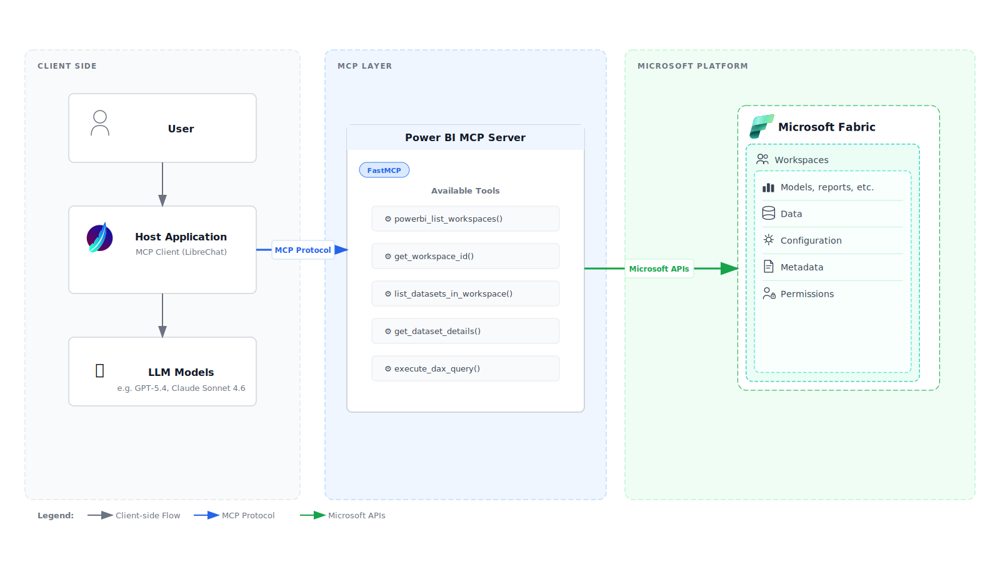

# MCP Server for Power BI

[](https://github.com/Mitsubishi-Fuso/mcp-server-for-powerbi/actions/workflows/codeql.yml)
[](https://deepwiki.com/Mitsubishi-Fuso/mcp-server-for-powerbi)
[](https://github.com/Mitsubishi-Fuso/mcp-server-for-powerbi/blob/main/LICENSE)

Model Context Protocol (MCP) server for exploring Microsoft Fabric / Power BI workspaces and semantic models, and for executing ad‑hoc DAX queries. 

**🔐 Now with OAuth/Entra ID support!** Seamlessly integrates with LibreChat and other OAuth-enabled clients using JWT validation and On-Behalf-Of flow.

## Architecture Overview



## Features
| Tool | Purpose |
|------|---------|
| `powerbi_list_workspaces()` | List workspaces the signed-in user can access. |
| `get_workspace_id(workspace_name)` | Get the workspace ID for a given workspace name. |
| `list_datasets_in_workspace(workspace_id)` | Enumerate datasets in a workspace. |
| `get_dataset_details(workspace_id, dataset_id)` | Retrieve dataset (semantic model) metadata and definition via Fabric. |
| `execute_dax_query(workspace_id, dataset_id, dax_query)` | Run a DAX query against a dataset using the Execute Queries API. |

## Transport Modes

### 🌐 HTTP Transport with OAuth (Recommended for Production)
- Full Entra ID/Azure AD authentication
- JWT token validation with JWKS
- On-Behalf-Of (OBO) flow for Power BI and Fabric API access
- Role and scope-based authorization
- Claims challenge support for conditional access
- **Perfect for LibreChat integration**

### 💻 STDIO Transport (Local Development)
- Simple bearer token authentication
- Direct Power BI API access
- Suitable for local testing with MCP clients

## Requirements
* Python 3.12+
* [uv](https://docs.astral.sh/uv/) (fast Python package/project manager)
* For HTTP mode: Azure AD app registrations with OAuth configured
* For STDIO mode: Power BI access token

## Development

### Code Quality Tools

This project uses [Ruff](https://docs.astral.sh/ruff/) for linting and formatting, and [ty](https://docs.astral.sh/ty/) for type checking.

**Install development dependencies:**
```bash
uv sync --extra dev
```

**Run Ruff linting:**
```bash
uv run ruff check .
```

**Run ty type checking:**
```bash
uv run ty check mcp_for_powerbi/
```

## Quick Start

### HTTP Mode with OAuth (LibreChat)

1. **Install dependencies:**
```bash
uv sync
```

2. **Configure environment** (copy [.env.example](.env.example)):
```bash
# Azure AD Configuration
PORT=3001
TENANT_ID=your-tenant-id
AUDIENCE=your-api-app-id
OBO_CLIENT_ID=your-obo-client-id
OBO_CLIENT_SECRET=your-obo-client-secret

# Authorization
REQUIRED_SCOPES=mcp.access
REQUIRED_ROLES=mcp.user

# Logging
LOG_LEVEL=info
```

3. **Run the server:**
```bash
python -m mcp_for_powerbi.server_http
```

Server starts on `http://localhost:3001/mcp`

### STDIO Mode (Local Development)

**Note:** STDIO mode now requires OAuth integration. The server expects the Authorization header to be passed via the MCP client.

**Run the server:**
```bash
uv run mcp-for-powerbi
```

## Authentication

### OAuth with Entra ID

Both HTTP and STDIO modes now use Entra ID OAuth2 with:
- **JWT Validation**: Verifies token signature, audience, issuer
- **OBO Flow**: Exchanges user token for downstream Power BI and Fabric tokens (resource-bound)
- **Authorization**: Validates roles and scopes

## Client Integration Examples

### LibreChat (HTTP with OAuth)

```yaml
mcpServers:
  mcp-server-for-powerbi:
    type: streamable-http
    url: http://localhost:3001/mcp
    requiresOAuth: true
    oauth:
      authorization_url: https://login.microsoftonline.com/<tenant-id>/oauth2/v2.0/authorize
      token_url: https://login.microsoftonline.com/<tenant-id>/oauth2/v2.0/token
      client_id: <client-id>
      client_secret: <client-secret>
      scope: "api://<api-app-id>/mcp.access openid profile offline_access"
      redirect_uri: http://localhost:3080/api/mcp/mcp-server-for-powerbi/oauth/callback
```

### Cherry Studio (STDIO)
```json
{
  "mcpServers": {
    "mcp-for-powerbi": {
      "name": "mcp-for-powerbi",
      "type": "stdio",
      "isActive": true,
      "registryUrl": "",
      "command": "uv",
      "args": [
        "run",
        "--directory",
        "<your_directory>/mcp-server-for-powerbi",
        "mcp-for-powerbi"
      ]
    }
  }
}
```
**Note:** MCP client must pass OAuth token via Authorization header.
```

## Docker Deployment to Azure

- Login to Azure CLI and ACR

```bash
az login
az acr login --name <acr-name>
```

- Build the Docker image

```bash
docker build -t <acr-name>.azurecr.io/mcp-server-for-powerbi .
```

- Run the image locally for testing

```bash
docker run -it --rm -p 8080:8080 \
  -e TENANT_ID=<tenant-id> \
  -e AUDIENCE=<api-app-id> \
  -e OBO_CLIENT_ID=<obo-client-id> \
  -e OBO_CLIENT_SECRET=<obo-secret> \
  <acr-name>.azurecr.io/mcp-server-for-powerbi
```

- Push the image to ACR

```bash
docker push <acr-name>.azurecr.io/mcp-server-for-powerbi
```

## Error Handling & Troubleshooting
The server raises structured MCP tool errors with detailed suggestions:
* `Missing Authorization` – OAuth token not provided in Authorization header.
* `TokenExpired` – obtain a fresh token (user tokens are short‑lived).
* `Unauthorized` (401) – token is invalid or lacks required permissions.
* `Forbidden` (403) – user lacks permission to the workspace or dataset.
* `NotFound` (404) – invalid `workspace_id` or `dataset_id`.
* `BadRequest` (400) – invalid parameters or DAX syntax errors.
* `TooManyRequests` (429) – rate limit exceeded (120 requests per minute).
* `Timeout` – network / API slowness (default timeout 30s).

Each error includes:
- **Error code and message** from the Power BI API
- **Context-aware suggestions** to help resolve the issue
- **Parameter validation** for workspace_id and dataset_id (UUID format)
- **DAX-specific error analysis** with syntax and semantic suggestions

## Acknowledgments
This project is built on [FastMCP v2](https://gofastmcp.com/getting-started/quickstart) and draws inspiration from the following repositories:

* Inspired by an internal project
* [fabric-toolbox/SemanticModelMCPServer](https://github.com/microsoft/fabric-toolbox/tree/main/tools/SemanticModelMCPServer)

Their approaches to semantic model surfacing and Power BI integration helped shape the tool design here.

## License

This project is licensed under the MIT License. See the [LICENSE](LICENSE) file for details.

## Disclaimer

This project is an independent, open‑source MCP server for Microsoft Power BI.
It is not affiliated with, endorsed by, or sponsored by Microsoft.
“Power BI” is a trademark of Microsoft Corporation.
