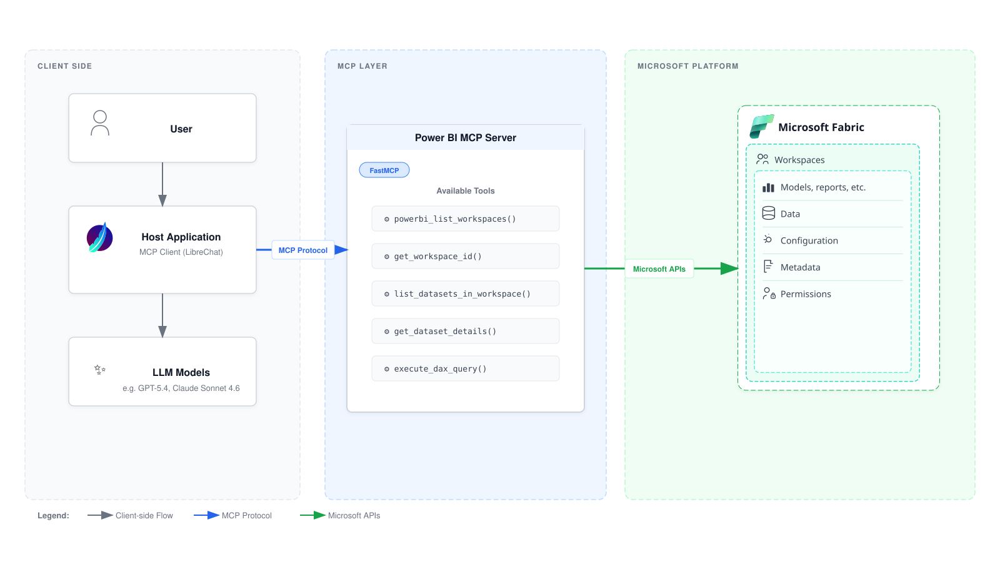

# MCP Server for Power BI

[](https://github.com/Mitsubishi-Fuso/mcp-server-for-powerbi/actions/workflows/codeql.yml)
[](https://deepwiki.com/Mitsubishi-Fuso/mcp-server-for-powerbi)
[](https://github.com/Mitsubishi-Fuso/mcp-server-for-powerbi/blob/main/LICENSE)

Model Context Protocol (MCP) server for exploring Microsoft Fabric / Power BI workspaces and semantic models, and for executing ad‑hoc DAX queries.

**🔐 OAuth/Entra ID support.** Integrates with LibreChat and other OAuth-enabled clients, with a choice of On-Behalf-Of or custody authentication.

## Architecture Overview



## Features
| Tool | Purpose |
|------|---------|
| `powerbi_list_workspaces()` | List workspaces the signed-in user can access. |
| `get_workspace_id(workspace_name)` | Get the workspace ID for a given workspace name. |
| `list_datasets_in_workspace(workspace_id)` | Enumerate datasets in a workspace. |
| `get_dataset_details(workspace_id, dataset_id)` | Retrieve dataset (semantic model) metadata and structure via DAX introspection |
| `execute_dax_query(workspace_id, dataset_id, dax_query)` | Run a DAX query against a dataset using the Execute Queries API. |

## Transport Modes

### 🌐 HTTP Transport with OAuth (Recommended for Production)
- Full Entra ID/Azure AD authentication
- JWT token validation with JWKS
- On-Behalf-Of or custody authentication for Power BI access
- Role and scope-based authorization
- Claims challenge support for conditional access
- **Perfect for LibreChat integration**

### 💻 STDIO Transport (Local Development)
- Simple bearer token authentication
- Direct Power BI API access
- Suitable for local testing with MCP clients

## Requirements
* Python 3.12+
* [uv](https://docs.astral.sh/uv/) (fast Python package/project manager)
* For HTTP mode: Azure AD app registrations with OAuth configured
* For STDIO mode: Power BI access token

## Development

### Code Quality Tools

This project uses [Ruff](https://docs.astral.sh/ruff/) for linting and formatting, and [ty](https://docs.astral.sh/ty/) for type checking.

**Install development dependencies:**
```bash
uv sync --extra dev
```

**Run Ruff linting:**
```bash
uv run ruff check .
```

**Run ty type checking:**
```bash
uv run ty check mcp_for_powerbi/
```

## Quick Start

### HTTP Mode with OAuth (LibreChat)

1. **Install dependencies:**
```bash
uv sync
```

2. **Configure environment** (copy [.env.example](.env.example)):
```bash
# Azure AD Configuration
PORT=3001
TENANT_ID=your-tenant-id
AUDIENCE=your-api-app-id

# Authentication mode: obo or custody
AUTH_MODE=obo
ENTRA_CLIENT_ID=your-client-id
ENTRA_CLIENT_SECRET=your-client-secret

# Authorization
REQUIRED_SCOPES=mcp.access
REQUIRED_ROLES=mcp.user

# Logging
LOG_LEVEL=info
```

3. **Run the server:**
```bash
python -m mcp_for_powerbi.server_http
```

Server starts on `http://localhost:3001/mcp`

### STDIO Mode (Local Development)

**Note:** STDIO mode now requires OAuth integration. The server expects the Authorization header to be passed via the MCP client.

**Run the server:**
```bash
uv run mcp-for-powerbi
```

## Authentication

### OAuth with Entra ID

Both HTTP and STDIO modes use Entra ID OAuth2 with:
- **JWT Validation**: Verifies token signature, audience, issuer
- **Authorization**: Validates roles and scopes

### Authentication modes

`AUTH_MODE` selects how the server obtains a token for the Power BI API. The
server will not choose for you: an unrecognised mode, or one whose prerequisites
are missing, stops it at startup.

| Mode | How the Power BI token is obtained | Holds credentials? |
|---|---|---|
| `obo` | On-Behalf-Of exchange of the caller's token | No |
| `custody` | The server brokers the user's sign-in and keeps the refresh token | Yes, encrypted |

Both use `ENTRA_CLIENT_ID` / `ENTRA_CLIENT_SECRET`, and both present Power BI a
token issued to this server's own registration. Neither accepts a token that
Entra issued for a different resource, which the MCP authorization spec
prohibits.

**Which to choose.** `obo` is simpler and stores nothing long-lived; prefer it
where it works. Its limitation is structural: the exchange happens server-side,
so a conditional access policy that applies to the Power BI API but not to the
app the user signed in to fails with AADSTS50158, and the challenge arrives
somewhere the user cannot answer it.

`custody` exists for that case. The Power BI token comes from an authorization
code redeemed with the user's browser in the loop, so conditional access is
satisfied at sign-in. The cost is that the server holds a refresh token per
user: encrypted at rest, but durable access to Power BI as that user, so treat
the host accordingly.

### Custody mode

The MCP client runs an OAuth flow against **this server**, which runs its own
against Entra. Two relationships, and no token crosses a boundary it was not
issued for.

```
client ──/authorize──▶ server ──▶ Entra ──▶ server /callback
client ◀── our code ── server        (Entra's tokens stop here)
client ──/token─────▶ server ── our access + refresh token ──▶ client
```

Configure `PUBLIC_URL`, `CUSTODY_REDIRECT_URIS` and `SESSION_ENCRYPTION_KEY`
(see [.env.example](.env.example)), and add `PUBLIC_URL/callback` as a redirect
URI on the app registration.

PKCE with `S256` is required of clients, redirect URIs are matched exactly,
authorization codes are single use with a 60 second life, and access and refresh
tokens are rotated together so a replayed one is refused. Only digests of the
tokens are stored, so the store never holds a usable credential. Dynamic client
registration is not supported; clients are configured.

When a stored refresh token stops working — revoked, expired, or a policy
re-evaluation demanding interaction — the session is dropped and the client
receives a 401, prompting a fresh sign-in.

**Sharing an app registration.** `ENTRA_CLIENT_ID` may be the same registration
your MCP client already uses, which avoids requesting a new one. Note that Entra
sign-in logs then cannot distinguish the two, and rotating the secret affects
both. Pointing `ENTRA_CLIENT_ID` at a dedicated registration later is a config
change.

### Discovery

Both modes serve [RFC 9728](https://www.rfc-editor.org/rfc/rfc9728) protected
resource metadata at `/.well-known/oauth-protected-resource`, naming this server
as the authorization server under `custody` and the Entra tenant under `obo`, so
a client can discover where to authenticate instead of being configured with it.
Custody also serves [RFC 8414](https://www.rfc-editor.org/rfc/rfc8414) metadata
at `/.well-known/oauth-authorization-server`. Every 401 carries a
`WWW-Authenticate` header pointing at the resource metadata.

## Client Integration Examples

### LibreChat (HTTP with OAuth)

The client points at whoever issues the tokens, which differs by mode.

**`AUTH_MODE=obo`** — the client authenticates against Entra:

```yaml
mcpServers:
  mcp-server-for-powerbi:
    type: streamable-http
    url: http://localhost:3001/mcp
    requiresOAuth: true
    oauth:
      authorization_url: https://login.microsoftonline.com/<tenant-id>/oauth2/v2.0/authorize
      token_url: https://login.microsoftonline.com/<tenant-id>/oauth2/v2.0/token
      client_id: <client-id>
      client_secret: <client-secret>
      scope: "api://<api-app-id>/mcp.access openid profile offline_access"
      redirect_uri: http://localhost:3080/api/mcp/mcp-server-for-powerbi/oauth/callback
```

**`AUTH_MODE=custody`** — the client authenticates against this server, which
holds the Entra credentials, so no client secret is configured here:

```yaml
mcpServers:
  mcp-server-for-powerbi:
    type: streamable-http
    url: http://localhost:3001/mcp
    requiresOAuth: true
    oauth:
      authorization_url: https://powerbi-mcp.example.com/authorize
      token_url: https://powerbi-mcp.example.com/token
      client_id: librechat
      scope: "powerbi.read"
      redirect_uri: http://localhost:3080/api/mcp/mcp-server-for-powerbi/oauth/callback
```

The `redirect_uri` must appear in `CUSTODY_REDIRECT_URIS`, and
`authorization_url` must be reachable from the user's browser — set `PUBLIC_URL`
to the external address if the server sits behind an ingress.

### Cherry Studio (STDIO)
```json
{
  "mcpServers": {
    "mcp-for-powerbi": {
      "name": "mcp-for-powerbi",
      "type": "stdio",
      "isActive": true,
      "registryUrl": "",
      "command": "uv",
      "args": [
        "run",
        "--directory",
        "<your_directory>/mcp-server-for-powerbi",
        "mcp-for-powerbi"
      ]
    }
  }
}
```
**Note:** MCP client must pass OAuth token via Authorization header.
```

## Docker Deployment to Azure

- Login to Azure CLI and ACR

```bash
az login
az acr login --name <acr-name>
```

- Build the Docker image

```bash
docker build -t <acr-name>.azurecr.io/mcp-server-for-powerbi .
```

- Run the image locally for testing

```bash
docker run -it --rm -p 8080:8080 \
  -e TENANT_ID=<tenant-id> \
  -e AUDIENCE=<api-app-id> \
  -e AUTH_MODE=obo \
  -e ENTRA_CLIENT_ID=<client-id> \
  -e ENTRA_CLIENT_SECRET=<client-secret> \
  <acr-name>.azurecr.io/mcp-server-for-powerbi
```

- Push the image to ACR

```bash
docker push <acr-name>.azurecr.io/mcp-server-for-powerbi
```

## Error Handling & Troubleshooting
The server raises structured MCP tool errors with detailed suggestions:
* `Missing Authorization` – OAuth token not provided in Authorization header.
* `TokenExpired` – obtain a fresh token (user tokens are short‑lived).
* `Unauthorized` (401) – token is invalid or lacks required permissions.
* `Forbidden` (403) – user lacks permission to the workspace or dataset.
* `NotFound` (404) – invalid `workspace_id` or `dataset_id`.
* `BadRequest` (400) – invalid parameters or DAX syntax errors.
* `TooManyRequests` (429) – rate limit exceeded (120 requests per minute).
* `Timeout` – network / API slowness (default timeout 30s).

Each error includes:
- **Error code and message** from the Power BI API
- **Context-aware suggestions** to help resolve the issue
- **Parameter validation** for workspace_id and dataset_id (UUID format)
- **DAX-specific error analysis** with syntax and semantic suggestions

## Acknowledgments
This project is built on [FastMCP v2](https://gofastmcp.com/getting-started/quickstart) and draws inspiration from the following repositories:

* Inspired by an internal project
* [fabric-toolbox/SemanticModelMCPServer](https://github.com/microsoft/fabric-toolbox/tree/main/tools/SemanticModelMCPServer)

Their approaches to semantic model surfacing and Power BI integration helped shape the tool design here.

## Contributors

<a href="https://github.com/Mitsubishi-Fuso/mcp-server-for-powerbi/graphs/contributors">
  
</a>

## License

This project is licensed under the MIT License. See the [LICENSE](LICENSE) file for details.

## Disclaimer

This project is an independent, open‑source MCP server for Microsoft Power BI.
It is not affiliated with, endorsed by, or sponsored by Microsoft.
“Power BI” is a trademark of Microsoft Corporation.
